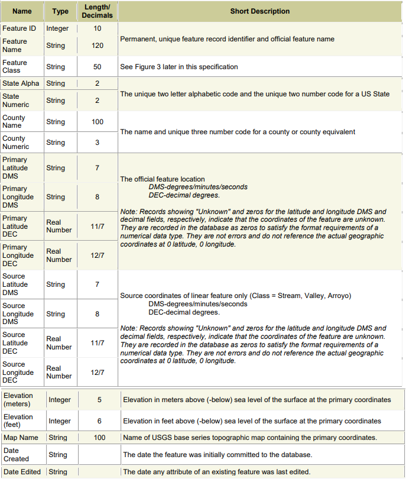

# Geographic Coordinate System (GIS)


## Introduction/Background

**Project description:** A geographic information system that organizes information pertaining to geographic features and provide various kinds of access
to the information. It is a system that will build and maintain several in-memory index data structures to support these operations:

- Importing new GIS records into the database file
- Retrieving data for all GIS records matching given geographic coordinates
- Retrieving data for all GIS records matching a given feature name and state
- Retrieving data for all GIS records that fall within a given (rectangular) geographic region
- Displaying the in-memory indices in a human-readable manner


This was a project for my Data Structures and Algorithms class in Spring 2021. Out of the 5 projects for that class, this was project #4, but it incorperates projects #1-3, meaning this is the result and combination of 4 projects for this class. It incorperates various data structures, concepts, and skills that include:

- Hash Table
- PR Quad Tree
- Buffer Pool
- File and String Parsing and Management
- Encapsulation, Abstraction, and Class Management


## Detailed Look

### 1. Arguments

When the GIS is ran on the terminal, it accepts 3 arguments:

- Name of database file
- Name of script file
- Name of output log file

The database file is the text file that holds all GIS records that fall within the boundaries given in the world command.
The script file is a text file of commands that the GIS will read and run.
The output log file is the text file with the results from the commands read from the script file.

Only the script file needs to exist before running this. The database file and the output log file will be created with the user given name if they do not exist at the time of running.

### 2. GIS Records

**Format of a GIS Record**



[Example of a GIS Record Data File](/text_files/GIS/VA_MontereySmall.txt)

### 3. Script Commands and Format

Each line in the script file ether starts with a ";" or not. It denotes that the line is a comment and the GIS will ignore this line.

A non-commented line denotes a command to run. There are 5 different types of commands:

- world
- import
- debug
- search
- quit

#### **World (westLong) (eastLong) (southLat) (northLat)**

This should be the first command in any script file. This sets up the boundaries for the GIS system. When importing any records, it only accepts records within this given boundary. The four parameters will be longitude and latitudes expressed in DMS format.

#### **Import (GIS record file name)**

This fills the GIS with all records that fall within the boundaries. When the GIS is being "filled", that means that record entries are filling the data structures and the database file is being written to.

#### **Debug [ quad | hash | pool ]**

This command prints to the output file a human-readable version of the selected data structure

#### **Search**

This command returns the informataion for records that are searched. There are 3 kinds of search commands:

```
what_is_at (geographic coordinate)
For every GIS record in the database file that matches the given <geographic coordinate>, log the offset at
which the record was found, and the feature name, county name, and state abbreviation

what_is (feature name) (state abbreviation)
For every GIS record in the database file that matches the given <feature name> and <state
abbreviation>, log the offset at which the record was found, and the county name, the primary latitude, and the
primary longitude

what_is_in (geographic coordinate) (half-height) (half-width)
For every GIS record in the database file whose coordinates fall within the closed rectangle with the specified height
and width, centered at the <geographic coordinate>, log the offset at which the record was found, and the
feature name, the state name, and the primary latitude and primary longitude.

If a (geographic coordinate) is specified for a command, it will be expressed as a pair of latitude/longitude values,
expressed in the same DMS format that is used in the GIS record files
  
```

#### **Quit**

The last command in the script. It signals to the GIS that the script file is over

[Example of a Script File](/text_files/GIS/DemoScript05.txt)

[Example of a Output Log File](/text_files/GIS/DemoLog05.txt)


## Download/Code


This was a project for Data Structures and Algorithms class in Spring 2021. Due to honor code I am unable to show the code publically. If you wish to see it, please reach out to my email brnguyen2017@gmail.com
