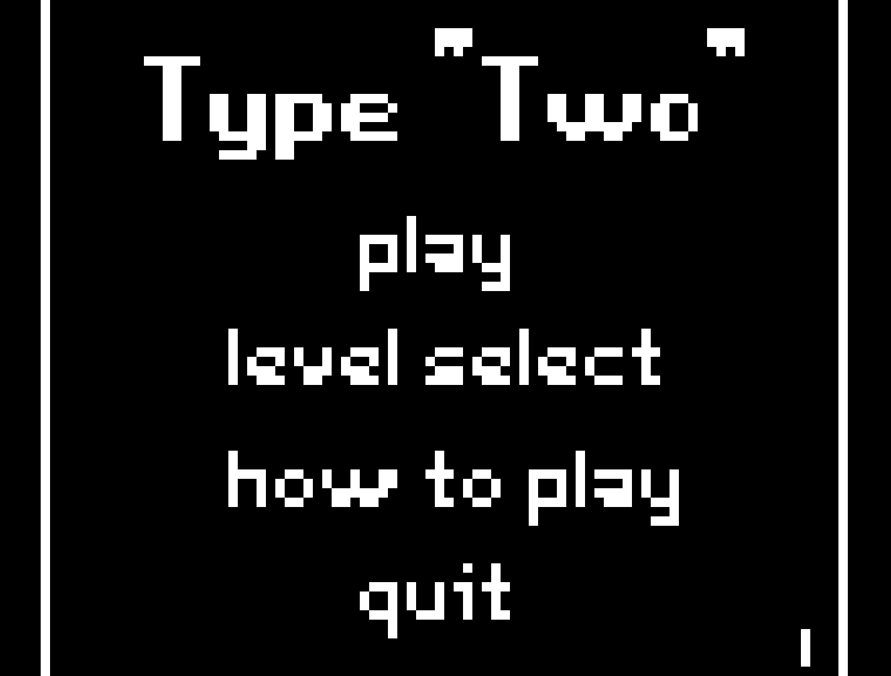
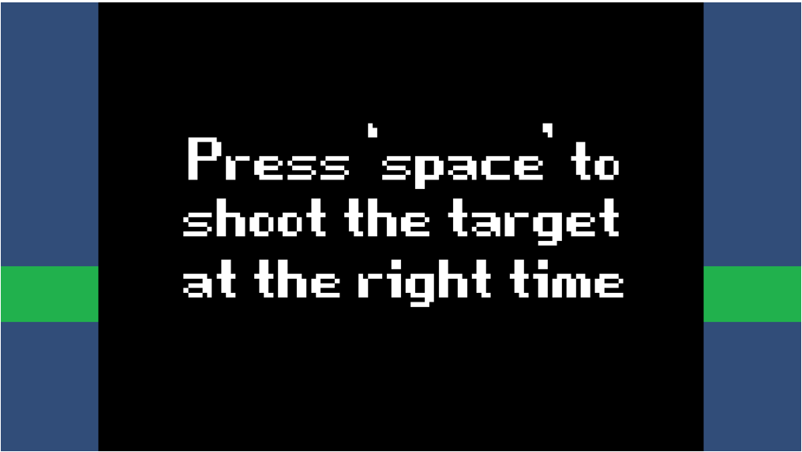
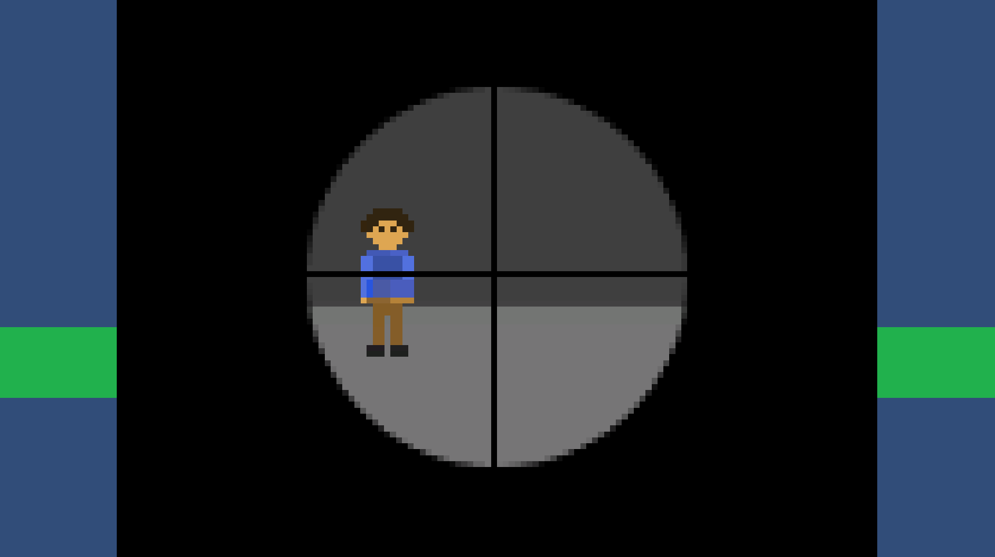
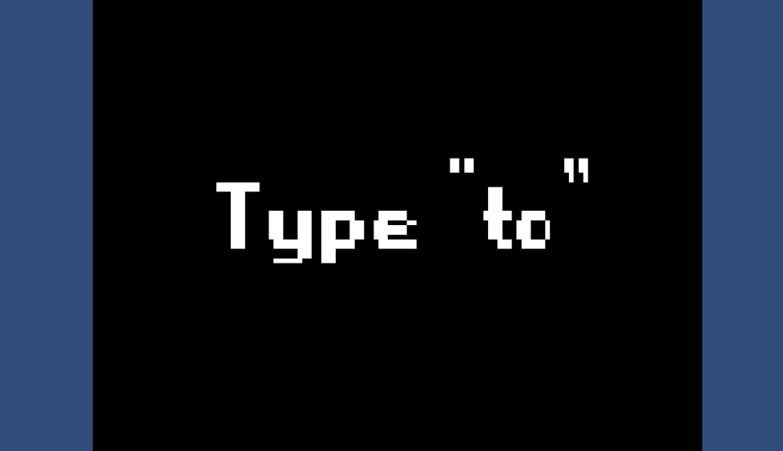
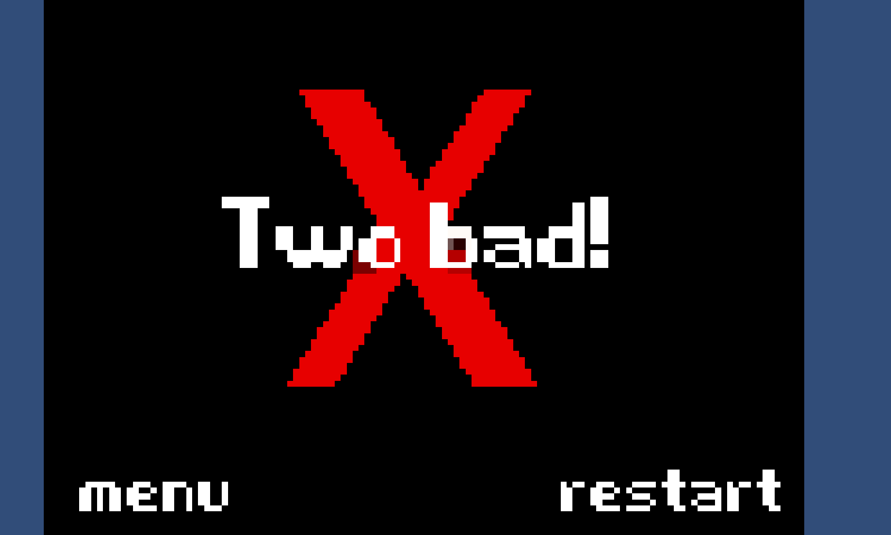

# Type-Two

## Introduction/Background
**Project description:** A game created by a group of 5 for the VTGP Club GameJam for Spring 2019. Based and inspired by the game "Wario Ware".

The theme for this GameJam was "Two". Some groups took this as making a two player game and others made a game that only used two buttons. Our group thought of a simple mini-game where the player just types "two". From there on, we wanted to make a Wario Ware like game where we created a bunch of mini-games and the type two mini-game was the first of multiple.

Credits:

- Ken
- Kevin
- James
- Brian
- Chris

## Demo

https://user-images.githubusercontent.com/71103676/146651407-b6dde4c0-e67b-4968-895c-7de710e3fff3.mp4

## Images

 

## Download/Code

[Type-Two](/zip_files/Type-Two/typetwofinal.zip)

